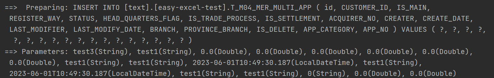
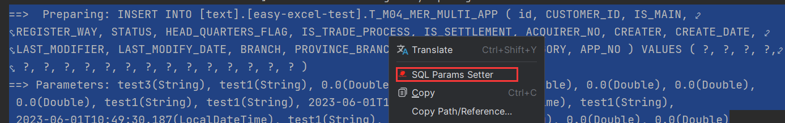

# 1.执行SQL分析打印

2023-6-1

引入依赖

~~~xml
<dependency>
    <groupId>p6spy</groupId>
    <artifactId>p6spy</artifactId>
    <version>3.9.1</version>
</dependency>
~~~

yml配置

~~~yaml
spring:
  datasource:
    driver-class-name: com.p6spy.engine.spy.P6SpyDriver
    # jdbc:p6spy:{正常连接数据库的url}
    url: jdbc:p6spy:sqlserver://localhost;DatabaseName=text
    ......
~~~

创建一个spy.properties

~~~properties
#3.2.1以上使用
modulelist=com.baomidou.mybatisplus.extension.p6spy.MybatisPlusLogFactory,com.p6spy.engine.outage.P6OutageFactory
#3.2.1以下使用或者不配置
#modulelist=com.p6spy.engine.logging.P6LogFactory,com.p6spy.engine.outage.P6OutageFactory
# 自定义日志打印
logMessageFormat=com.baomidou.mybatisplus.extension.p6spy.P6SpyLogger
#日志输出到控制台
appender=com.baomidou.mybatisplus.extension.p6spy.StdoutLogger
# 使用日志系统记录 sql
#appender=com.p6spy.engine.spy.appender.Slf4JLogger
# 设置 p6spy driver 代理
deregisterdrivers=true
# 取消JDBC URL前缀
useprefix=true
# 配置记录 Log 例外,可去掉的结果集有error,info,batch,debug,statement,commit,rollback,result,resultset.
excludecategories=info,debug,result,commit,resultset
# 日期格式
dateformat=yyyy-MM-dd HH:mm:ss
# 实际驱动可多个
#driverlist=org.h2.Driver
# 是否开启慢SQL记录
outagedetection=true
# 慢SQL记录标准 2 秒
outagedetectioninterval=2
~~~

注意！

- driver-class-name 为 p6spy 提供的驱动类
- url 前缀为 jdbc:p6spy 跟着冒号为对应数据库连接地址
- 打印出 sql 为 null,在 excludecategories 增加 commit
- 批量操作不打印 sql,去除 excludecategories 中的 batch
- 批量操作打印重复的问题请使用 MybatisPlusLogFactory (3.2.1 新增）
- 该插件有性能损耗，不建议生产环境使用。

# 2.好用的插件

SQL Params Setter

 

控制台中输出的sql语句和入参

选择之后右键

然后就可以生成sql语句了

~~~sql
INSERT 
INTO
    [text]
    .[easy-excel-test].T_M04_MER_MULTI_APP (
        id, CUSTOMER_ID, IS_MAIN, REGISTER_WAY, STATUS, HEAD_QUARTERS_FLAG, IS_TRADE_PROCESS, IS_SETTLEMENT, ACQUIRER_NO, CREATER, CREATE_DATE, LAST_MODIFIER, LAST_MODIFY_DATE, BRANCH, PROVINCE_BRANCH, IS_DELETE, APP_CATEGORY, APP_NO 
    ) 
VALUES
    ( 'test3', 'test1', 0.0, 0.0, 0.0, 0.0, 0.0, 0.0, 'test1', 'test1', 2023-06-01T10:49:30.187, 'test1', 2023-06-01T10:49:30.187, 'test1', 'test1', '0', 0.0, 0.0 );
~~~