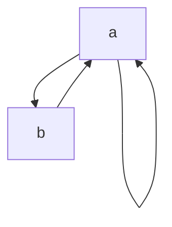

# 1.md文档画有向图

# 2.公式 

$$
\displaystyle \left( \sum_{k=1}^n a_k b_k \right)^2 \leq \left( \sum_{k=1}^n a_k^2 \right) \left( \sum_{k=1}^n b_k^2 \right)
$$

# 3.论文交叉引用

## Footnotes

Here's a simple footnote,[^1] and here's a longer one.[^bignote]

[^1]: This is the first footnote.
[^bignote]: Here's one with multiple paragraphs and code.

    Indent paragraphs to include them in the footnote.
    
    `{ my code }`
    
    Add as many paragraphs as you like.

# Gemoji

Thumbs up: :+1:, thumbs down: :-1:.

Families: :family_man_man_boy_boy:

Long flags: :wales:, :scotland:, :england:.