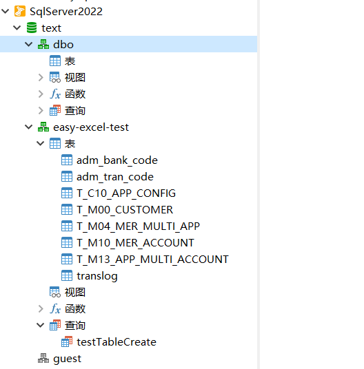
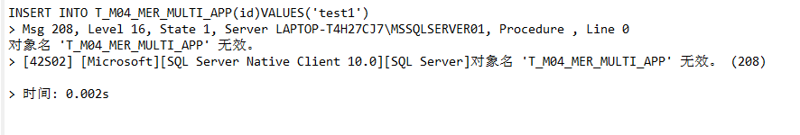

# 1. sq语句问题

2023-5-31

SQLserver的sql语句在指定表名时，如果表不是在SQLserver默认的模式即dbo模式中时，表名前面需要指定数据库名称和模式名称。

 

比如图中的T_M04_MER_MULTI_APP表

因为不在dbo中，所以sql语句如下：

~~~sql
INSERT INTO [text].[easy-excel-test].T_M04_MER_MULTI_APP(id)VALUES('test1')
~~~

如果只有表名，则会报一下错误：

# 2.mybatisplus+SQLserver

2023-5-31

配置方面只有驱动不同

主要的问题在于如何改变sql语句，以致于能够操作dbo模式外中的表。sql语句的正确格式在1中

通过全局配置实现对mybatisplus的内置sql语句中的表名添加前缀，配置如下：

~~~yaml
mybatis-plus:
  global-config:
    db-config:
      schema: "[text].[easy-excel-test]"
~~~

db-config中还有一个配置是table-prefix，但是测试的时候显示的sql语句中，表名前面并没有加上前缀，不清楚什么问题。

